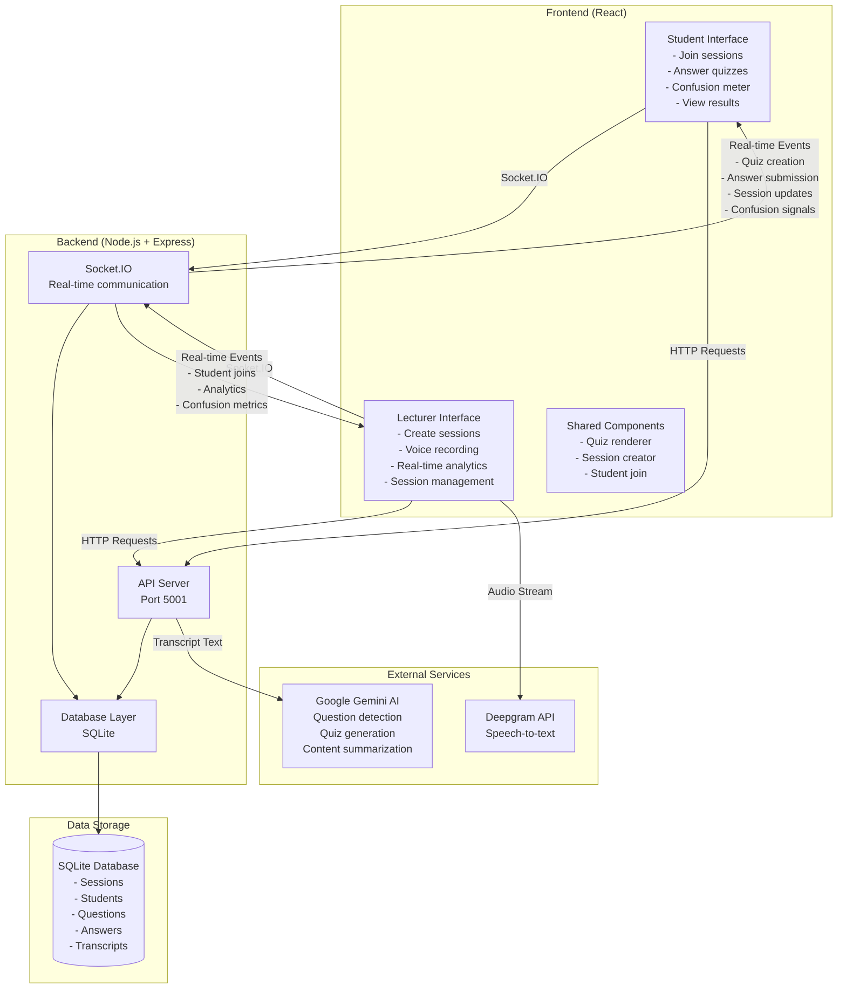

# 🎓 Lec-Recall

**Your intelligent learning companion with AI-powered question detection and real-time student engagement**

Lec-Recall transforms traditional lectures into interactive, engaging experiences by automatically detecting questions in speech, generating real-time quizzes, and providing comprehensive analytics for both lecturers and students.

## ✨ Features

### For Lecturers
- 🎤 **Real-time Speech Transcription** - Powered by Deepgram API for accurate voice-to-text conversion
- 🤖 **AI Question Detection** - Google Gemini AI automatically identifies questions in your lecture
- ⚡ **Instant Quiz Generation** - Convert detected questions into multiple-choice quizzes automatically
- 📊 **Live Analytics Dashboard** - Monitor student engagement, quiz performance, and confusion levels
- 🤔 **Confusion Meter** - Real-time feedback on student understanding levels
- 📈 **Session Analytics** - Detailed post-session reports with performance insights
- 🎯 **Review Recommendations** - Identifies topics that need reinforcement based on student performance

### For Students
- 🔗 **Easy Session Joining** - Join lectures with simple 6-character codes
- 📝 **Interactive Quizzes** - Participate in real-time quizzes generated from lecture content
- 🤔 **Anonymous Feedback** - Signal confusion levels without revealing identity
- 📊 **Personal Analytics** - View your performance, correct/incorrect answers, and improvement areas
- 📚 **Lecture Summaries** - AI-generated summaries of lecture content for review
- 🌙 **Dark Mode Support** - Comfortable viewing in any lighting condition
- ♿ **Full Accessibility** - WCAG 2.1 AA compliant with screen reader support

## 🏗️ Architecture

The application follows a modern client-server architecture with real-time communication:

### Technology Stack
- **Frontend**: React 19, Socket.IO Client, CSS3 with custom properties
- **Backend**: Node.js, Express.js, Socket.IO Server
- **Database**: SQLite with structured schema
- **AI Services**: Google Gemini AI for content processing
- **Speech Recognition**: Deepgram API for real-time transcription
- **Real-time Communication**: WebSocket connections via Socket.IO

### System Architecture



## 🚀 Quick Start

### Prerequisites
- **Node.js** (version 16 or higher) - [Download here](https://nodejs.org/)
- **npm** (comes with Node.js)
- **API Keys** (see Environment Setup below)

### 1. Clone and Install
```bash
# Clone the repository
git clone https://github.com/yourusername/lec-recall.git
cd lec-recall

# Install frontend dependencies
npm install

# Install backend dependencies
cd lec-recall-backend
npm install
cd ..
```

### 2. Environment Setup
Create environment files with your API keys:

**Frontend (.env in root directory):**
```env
REACT_APP_DEEPGRAM_API_KEY=your_deepgram_api_key_here
REACT_APP_BACKEND_URL=http://localhost:5001
```

**Backend (lec-recall-backend/.env):**
```env
GEMINI_API_KEY=your_gemini_api_key_here
PORT=5001
```

**Getting API Keys:**
- **Deepgram**: Sign up at [deepgram.com](https://deepgram.com) for speech-to-text services
- **Google Gemini**: Get your API key from [Google AI Studio](https://aistudio.google.com/)

### 3. Start the Application
```bash
# Terminal 1: Start the backend server
cd lec-recall-backend
npm start

# Terminal 2: Start the frontend (in new terminal)
cd lec-recall
npm start
```

The application will be available at:
- **Frontend**: http://localhost:3000
- **Backend API**: http://localhost:5001

## 📁 Project Structure

```
lec-recall/
├── 🎨 Frontend (React Application)
│   ├── public/                     # Static assets
│   │   ├── index.html             # Main HTML template
│   │   └── manifest.json          # PWA configuration
│   ├── src/
│   │   ├── components/            # Reusable React components
│   │   │   ├── Quiz.js           # Interactive quiz component
│   │   │   ├── SessionCreator.js # Lecturer session setup
│   │   │   └── StudentJoin.js    # Student session joining
│   │   ├── App.js                # Main application component
│   │   ├── App.css               # Global styles and design system
│   │   └── index.js              # React application entry point
│   ├── package.json              # Frontend dependencies
│   └── .env                      # Frontend environment variables
│
├── 🔧 Backend (Node.js Server)
│   ├── config/
│   │   └── database.js           # Database configuration
│   ├── controllers/              # Business logic controllers
│   │   ├── analyticsController.js
│   │   ├── questionController.js
│   │   └── sessionController.js
│   ├── database/
│   │   ├── lec_recall.db         # SQLite database file
│   │   └── schema.sql            # Database schema
│   ├── middleware/               # Express middleware
│   │   ├── cors.js
│   │   └── errorHandler.js
│   ├── routes/                   # API route definitions
│   │   ├── analytics.js
│   │   ├── questions.js
│   │   └── sessions.js
│   ├── services/
│   │   └── geminiService.js      # AI service integration
│   ├── socket/
│   │   └── socketHandlers.js     # Real-time event handlers
│   ├── server.js                 # Main server entry point
│   ├── package.json              # Backend dependencies
│   └── .env                      # Backend environment variables
│
└── 📚 Documentation
    ├── README.md                 # This file
    └── instructions.md           # Additional setup instructions
```

## 🔄 How It Works

1. **Lecturer Setup**
   - Create a session with a name and time limit
   - Start recording your lecture using your microphone
   - The system automatically detects questions you ask
   - Students join using a simple 6-character code

2. **Real-Time Interaction**
   - Questions are converted into multiple-choice quizzes instantly
   - Students answer on their devices in real-time
   - Monitor student understanding through the confusion meter
   - See live analytics of student performance

3. **Session Completion**
   - End the session to generate comprehensive analytics
   - Review which topics need reinforcement
   - Students receive personalized performance reports
   - AI-generated lecture summaries help with review

#### Data Flow
1. **Speech Processing**: Deepgram API converts lecturer audio to text
2. **AI Analysis**: Gemini AI processes transcripts to detect questions
3. **Quiz Generation**: Detected questions are converted to multiple-choice format
4. **Real-time Distribution**: Socket.IO broadcasts quizzes to connected students
5. **Response Collection**: Student answers are stored and analyzed in real-time
6. **Analytics Generation**: Performance metrics and insights are calculated

#### Key Technologies
- **WebRTC/MediaRecorder**: Browser audio capture
- **Socket.IO**: Bidirectional real-time communication
- **SQLite**: Lightweight, serverless database
- **React Hooks**: Modern state management
- **CSS Custom Properties**: Theming and design system
- **ARIA**: Accessibility compliance

## 🔌 API Endpoints

### REST API
- `GET /health` - Server health check
- `GET /api` - API documentation
- `GET /api/sessions/:id/analytics` - Session analytics
- `POST /api/sessions` - Create new session
- `POST /api/questions` - Create quiz question

### Socket.IO Events
- `create-session` - Lecturer creates new session
- `join-session` - Student joins existing session
- `quiz-created` - New quiz available for students
- `submit-answer` - Student submits quiz answer
- `signal-confusion` - Student signals understanding level
- `stop-session` - Lecturer ends session
- `session-ended` - Session termination notification

## 🛠️ Development

### Running in Development Mode
```bash
# Backend with auto-reload
cd lec-recall-backend
npm run dev

# Frontend with hot reload
cd lec-recall
npm start
```

### Environment Variables
Ensure you have the following environment variables configured:

**Frontend (.env)**
- `REACT_APP_DEEPGRAM_API_KEY` - Deepgram API key for speech recognition
- `REACT_APP_BACKEND_URL` - Backend server URL (default: http://localhost:5001)

**Backend (.env)**
- `GEMINI_API_KEY` - Google Gemini AI API key
- `PORT` - Server port (default: 5001)

### Database Schema
The SQLite database includes tables for:
- **sessions** - Lecture session metadata
- **students** - Student information and session participation
- **questions** - Generated quiz questions and metadata
- **answers** - Student responses and performance data
- **transcripts** - Speech-to-text transcription data

## 🎨 Design Features

### Modern UI/UX
- **Glass morphism design** with backdrop blur effects
- **Responsive layout** that works on desktop, tablet, and mobile
- **Dark/light mode** with system preference detection
- **Smooth animations** and micro-interactions
- **Color-coded feedback** for different states and actions

### Accessibility (WCAG 2.1 AA Compliant)
- **Screen reader support** with proper ARIA labels
- **Keyboard navigation** for all interactive elements
- **High contrast ratios** for text readability
- **Skip links** for efficient navigation
- **Semantic HTML** structure
- **Focus indicators** for better usability

## 🔒 Security & Privacy

- **Environment variables** for secure API key management
- **Anonymous student participation** - no personal data required
- **Local data storage** - all session data stays on your server
- **CORS protection** for secure cross-origin requests
- **Input validation** and error handling

## 🚀 Deployment

### Production Build
```bash
# Build frontend for production
npm run build

# Start backend in production mode
cd lec-recall-backend
NODE_ENV=production npm start
```

### Environment Setup for Production
- Set up environment variables on your server
- Configure proper CORS settings
- Set up SSL certificates for HTTPS
- Configure firewall rules for ports 3000 and 5001

## 🤝 Contributing

We welcome contributions! Here's how to get started:

1. **Fork the repository**
2. **Create a feature branch**: `git checkout -b feature/amazing-feature`
3. **Make your changes** and test thoroughly
4. **Commit your changes**: `git commit -m 'Add amazing feature'`
5. **Push to your branch**: `git push origin feature/amazing-feature`
6. **Open a Pull Request** with a detailed description

### Development Guidelines
- Follow the existing code style and patterns
- Add comments for complex logic
- Test your changes with both lecturer and student flows
- Ensure accessibility standards are maintained
- Update documentation for new features

## 📋 Troubleshooting

### Common Issues

**Backend won't start:**
- Check if port 5001 is available: `lsof -i :5001`
- Verify environment variables are set correctly
- Check API key validity

**Frontend connection issues:**
- Ensure backend is running on port 5001
- Check browser console for WebSocket connection errors
- Verify CORS settings in backend

**Audio not working:**
- Grant microphone permissions in your browser
- Check Deepgram API key and quota
- Test with different browsers (Chrome recommended)

**AI features not working:**
- Verify Gemini API key is valid and has quota
- Check network connectivity to Google AI services
- Review backend logs for API errors

## 📄 License

This project is licensed under the MIT License - see the [LICENSE](LICENSE) file for details.

---

**Built with ❤️ for educators and learners everywhere**

*Transform your lectures, engage your students, and enhance learning outcomes with Lec-Recall.*